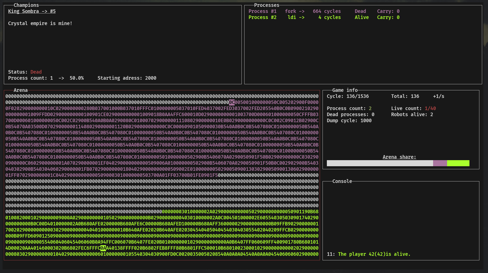

# **Corewar**  

**The Corewar tournament is a game in which several programs called champions will fight to stay the last one alive.**  

  

---

## **Table of Contents**  
- [Features](#features)  
- [Installation](#installation)  
- [Usage](#usage)  
- [Acknowledgements](#acknowledgements)  

---

## **Features**  
✨ Key features: <br>
✔️ Efficient virtual machine <br>
✔️ Beautiful graphic version <br>

---

## **Installation**  
**Prerequisites:** <br>
Default:
- GCC / Clang

Graphic version (all provided in the installer script):
- Raylib
- Ncurses
- SDL

**Steps:**  
1. Clone the repository:  
   ```sh
   git clone https://github.com/EpitechPGEPromo2029/B-CPE-200-TLS-2-1-corewar-valentin.bort-esgueva.git --depth=1
   ```
2. Navigate to the project directory:
   ```sh
   cd B-CPE-200-TLS-2-1-corewar-valentin.bort-esgueva
   ```
3. Install dependencies:
   ```sh
   ./installer.sh
   ```
4. Compile project:
   ```sh
   make
   ```
4. For the graphic version:
   ```sh
   make bonus
   ```
---

## **Usage**
**Basic Commands:**
  ```sh
  ./corewar -h
  ./corewar [-dump nbr_cycle] [[-n prog_number] [-a load_address] prog_name] ...
  ```
**Examples**
```sh
./corewar -dump 1000 -n 5 abel.cor -a 2000 bill.cor
```

---

## ** Acknowledgements
- Thanks to Epitech for this wonderful project

---

**⭐ Star this repo if you liked it! ⭐**

---

